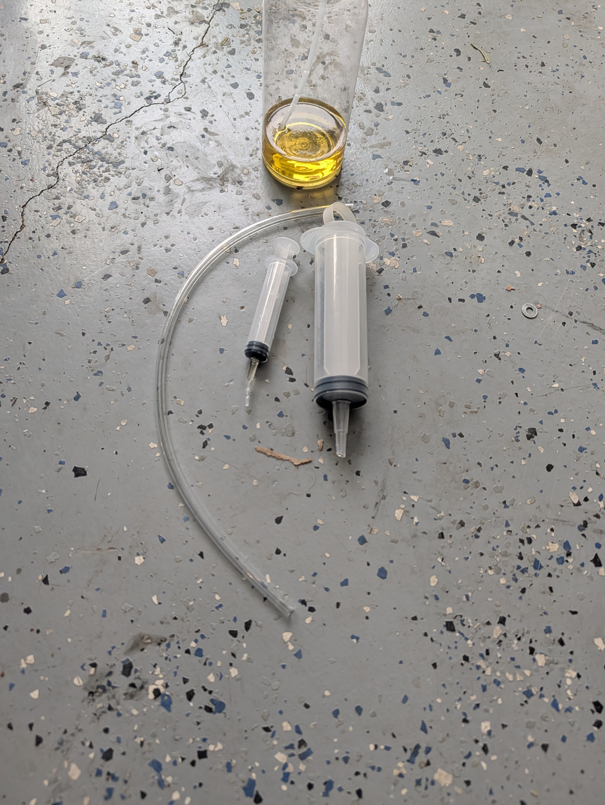
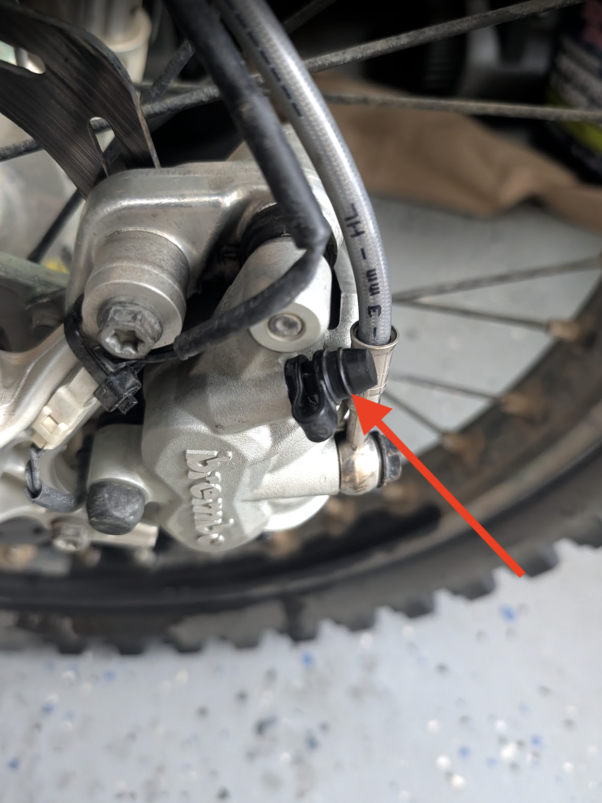

# Bleeding Front Brake

## Brake fluid kind

My repair manual states "DOT 4 / DOT 5.1". Check your manual to be sure.

## By-the-book process

This is from my KTM repair manual (annoyingly it is not in the owner's manual).

- Move the brake reservoir mounted on the handlebar to a horizontal position.
- Remove screwns on master cylinder.
- Take off cover with membrane.
- Extract the old brake fluid from the brake fluid reservoir using a syringe and fill with fresh brake fluid.
- Pull off protection cap of the brake caliper bleeder screw.
- Connect the bleeder bottle hose.
- Pull the hand brake lever and hold it in place.
- Open bleeder screw by approx. one half turn.
  - (Brake fluid runs into the bleeder bottle hose.)
- Tighten bleed screw.
- Release the hand brake lever.
- Repeat the procedure until fresh brake fluid emerges from the hose of the bleeder bottle without bubbles.
- Ensure that the brake fluid reservoir is always filled with a sufficient amount of fresh brake fluid.
- Remove the bleeder bottle hose. Mount protection cap.
- Add brake fluid up to level.

## Reverse bleeding

> [!CAUTION]
> This is my personal preferred process of reverse bleeding. It is NOT the processes recommended in the manual. There
> [may be reasons to avoid this method](https://claude.ai/public/artifacts/02e08f45-3935-43fd-ad61-743a30c5f089) so
> proceed at your own risk (linked report is an AI generated deep research and may contain inaccuracies).

### Why reverse bleeding?

- It's stupidly fast and easy.
- It's really good at getting air bubbles out.
- I only did did it successfully by the book once or twice until it wouldn't work, I think due to air bubbles lodged
  somewhere. I ended up having to reverse bleed anyway and decided to make reverse bleeding my default going forward
  instead of struggling.

### Equipment

This is what I use:

- Large syringe with hose (in this case, [this bleeder kit](https://www.amazon.com/dp/B0C1P2K2QW)) to push fluid through
  the bleeder valve up the line.
- Smaller syringe to evacuate the master cylinder (and precisely top off at end)./bleeding-pump).
- Bottle to dump used fluid in.

Picture:

### Process

- Get master cylindar in horizontal position and open it up.
- OPTIONAL: Start with by-the-book bleeding first (see above) and only proceed with reverse bleeding below if needed.
- Attach hose to bleeder valve, other side in large syringe (with plunger removed so you can fill it with brake fluid
  while already connected).
- Empty master cyliner using small syringe.
- Fill with brake fluid.
- Use a wrench to hold open the bleeder valve slightly WHILE plunging down and slowly watching the fluid rising in the
  master cylinder. Stop and empty into bottle when needed. Note that for me the bleeder valve bolt will tend to rate and
  close up on its own especially when pressing down. This is why I say to hold the bleeder valuve open as opposed to
  that being a separate step.

Bleeder valve:

