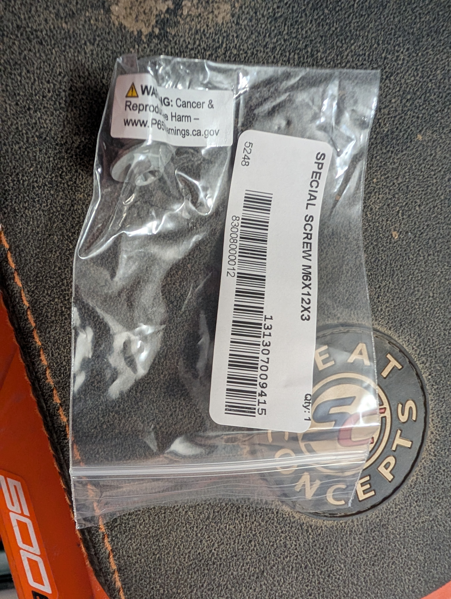
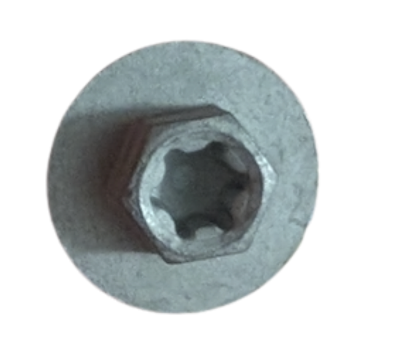
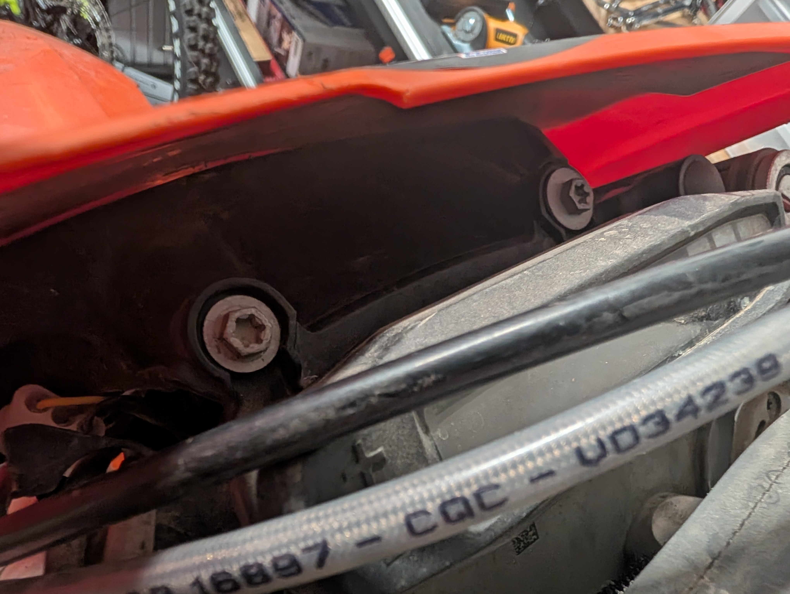

# Wtf is that part?

## That screw in front of the display

The screw is M6X12X3. This took me one time ordering the wrong one, then ordering all the screws even vaguely possibly
right from the parts diagram...

